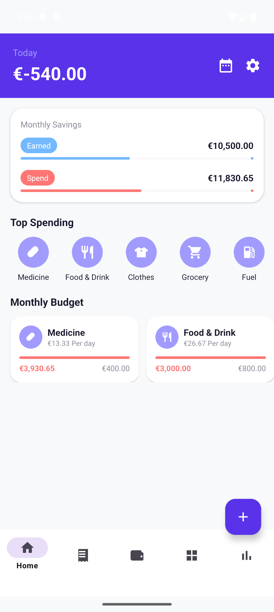
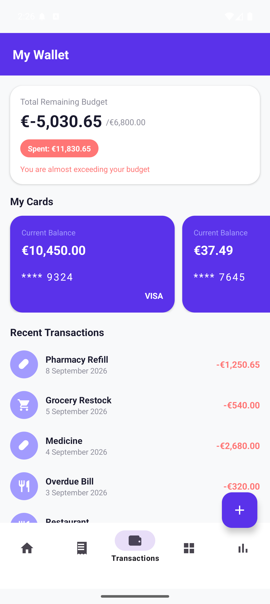
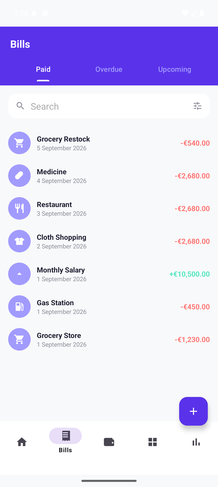
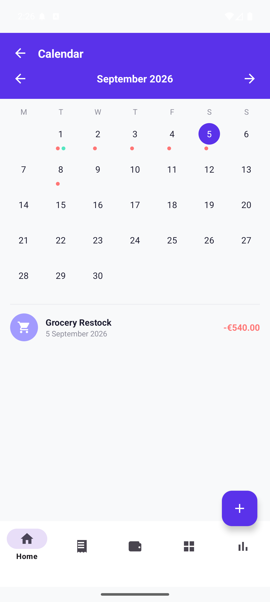
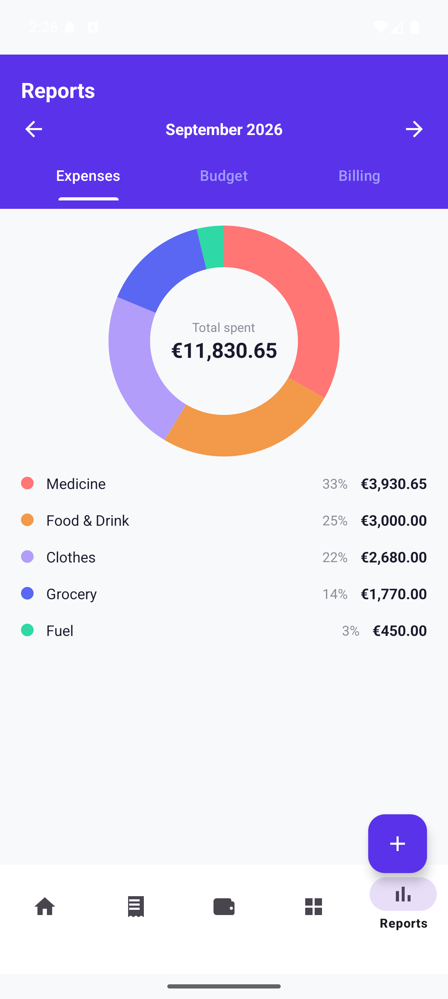
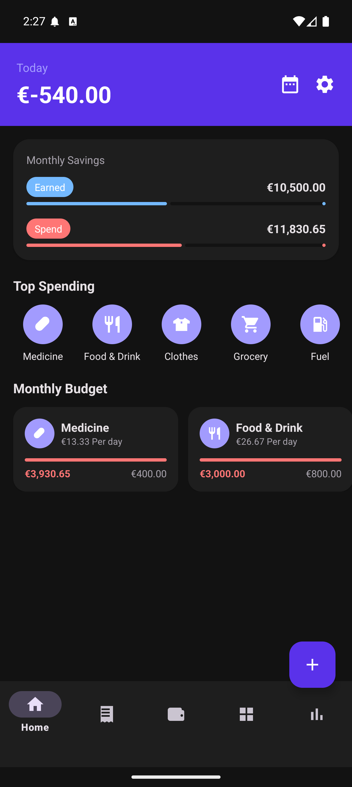
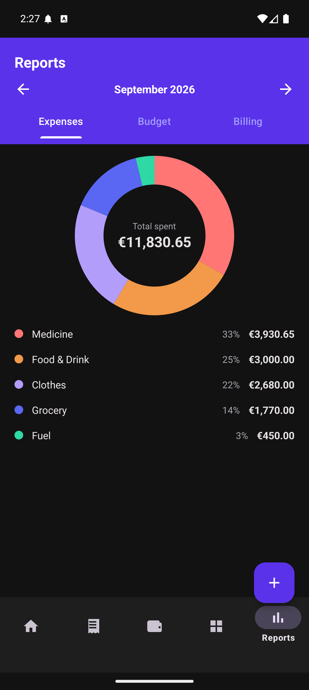
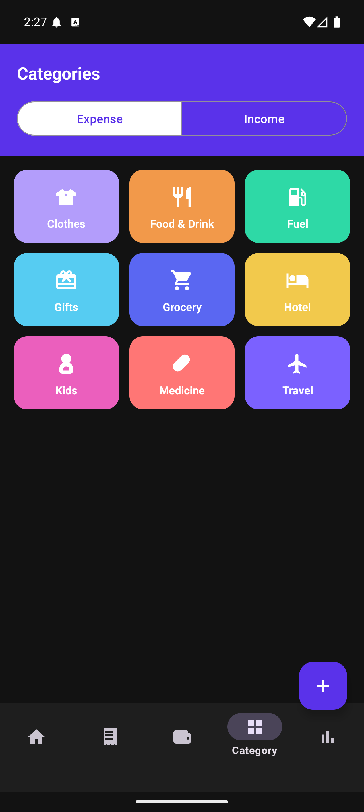

# Daily Expense Tracker

[](https://github.com/TanerKececi/DailyExpenseTracker/actions/workflows/ci.yml)

A personal finance tracker for Android — transactions, scheduled bills, a spending calendar and three
report views — built in Kotlin with MVVM + Clean Architecture, Room and Hilt.

Every chart is hand-drawn on a `Canvas`. There are **no third-party libraries** beyond AndroidX,
Material and Google's own tooling.

<p>
  
  
  
  
  
</p>

### Dark mode

<p>
  
  
  
</p>

---

## Features

| | |
|---|---|
| **Home** | Today's net, monthly earned/spent, top spending categories, per-category budget cards |
| **My Wallet** | Remaining budget, payment cards, recent transactions |
| **Categories** | Colour-coded grid, filtered by expense or income |
| **Add / edit transaction** | One bottom sheet for both, with delete behind a confirmation |
| **Bills** | Paid / Overdue / Upcoming tabs with live search, and an approve-or-decline detail screen |
| **Calendar** | Month grid with per-day expense and income markers, plus a day detail list |
| **Reports** | Expense donut, editable budget planner, and a six-month billing bar chart, sharing one month selector |
| **Settings** | Appearance (System / Light / Dark), currency symbol, first day of week, reset to sample data |

Sample data is seeded on first launch, so every screen is populated the moment you run it.

## Architecture

Three layers, with dependencies pointing inwards — `ui` and `data` both know `domain`; `domain`
knows neither.

```
ui/       Fragments + ViewModels, one package per screen. StateFlow in, view binding out.
domain/   Models, repository interfaces, use cases. Pure Kotlin, no Android imports.
data/     Room entities, DAOs and repository implementations.
di/       Hilt modules binding implementations to the domain's interfaces.
```

ViewModels expose a single `StateFlow<UiState>` per screen, built by combining use-case flows.
Fragments collect inside `repeatOnLifecycle(STARTED)`. Room emits `Flow`, so a write anywhere
refreshes every screen observing it without manual invalidation.

## Tech stack

| | |
|---|---|
| Language | Kotlin 2.2.0, coroutines + Flow |
| Architecture | MVVM + Clean Architecture |
| Persistence | Room 2.6.1 (KSP) |
| DI | Hilt 2.57 (KSP) |
| Navigation | Navigation Component 2.8.4 with Safe Args |
| UI | View system, ViewBinding + DataBinding, Material 3 |
| Build | AGP 8.13.2, Gradle version catalog, `compileSdk` 36, `minSdk` 24 |
| Testing | JUnit 4, `kotlinx-coroutines-test` |

## Testing

**129 unit tests across 20 suites**, all passing, alongside a clean `lintDebug` (0 errors).

Two complementary strategies:

- **Decision logic lives in pure objects** that take their inputs as parameters, so they test on the
  JVM with no framework at all — `BillBuckets` (which bill belongs in which tab), `CalendarMonth`
  (grid layout), `MonthRange` (month arithmetic), `MonthlyTotals` (bucketing) and the chart geometry.
- **Every ViewModel is tested directly against its `StateFlow`**, using fake repositories and a
  main-dispatcher rule. This is what catches wiring bugs the pure functions cannot see — a tab
  desynchronising from retained state, or an edit silently dropping a field it never displayed.

```bash
./gradlew testDebugUnitTest lintDebug
```

## Engineering notes

A few decisions that are more interesting than the feature list.

**No third-party dependencies.** The donut and bar charts are `View` subclasses drawing on a
`Canvas`, with their geometry in pure companion functions that are unit-tested independently of any
view. Adding MPAndroidChart would have been faster to write and impossible to test at that level.

**Overdue is derived, never stored.** A scheduled bill's tab is computed from its due date each time
it is read, so bills move from Upcoming to Overdue on their own. Storing a status would have gone
stale the moment a due date passed, with no background job to correct it.

**Settings are deliberately not reactive.** They are plain `SharedPreferences` read synchronously at
bind time. Because every fragment collects inside `repeatOnLifecycle(STARTED)`, returning to a screen
re-subscribes and the `StateFlow` re-emits — so a changed currency or week start reaches each screen
on its next visit for free. DataStore would have added a dependency to solve a problem the lifecycle
already solves.

**Dark mode is a colour model, not a toggle.** `@color/white` was doing two opposite jobs — card
surfaces and foreground on the purple header — so it was split, and colours were renamed after their
role rather than their appearance (`background`, not `background_light_gray`). Only then does a
`values-night` palette work, and only five colours need dark values.

## Building

Requires the Android SDK (`compileSdk` 36) and **JDK 17 or 21** — Gradle 8.13's embedded Kotlin DSL
compiler does not yet parse newer JDK version strings, so a JDK 22+ on your `PATH` will fail during
configuration. Android Studio's bundled JBR is a safe choice.

```bash
git clone https://github.com/TanerKececi/DailyExpenseTracker.git
cd DailyExpenseTracker
./gradlew installDebug
```

Or open the project in Android Studio and run the `app` configuration.
